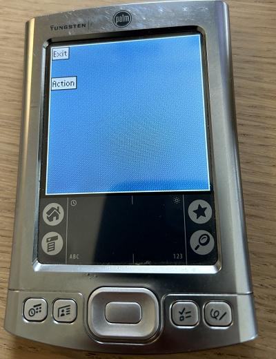
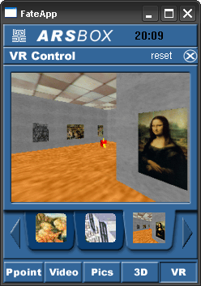
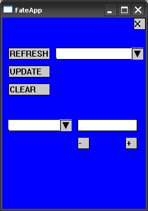
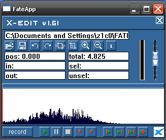

# FATE

To build and run this software, I used:

* A Windows XP virtual machine
* Microsoft Visual Studio 6.0
* Microsoft eMbedded Visual Tools 3.0
* Windows Mobile SDK 2002
* Metroworks CodeWarrior

[Internet Archive](https://archive.org) proved really valuable here.

## The Framework

*FATE* (Framework for Advanced Techniques of Interaction in Virtual Environments) is a framework that I developed while
working at [Ars Electronica Futurelab](https://ars.electronica.art/futurelab/) back in the day.
It also become the topic of my [master thesis](https://wolfgang-ziegler.com/repo/writing/thesis.pdf).

For more background on the framwork, its applications and why I brought this back to life 20 years later, you
can read this [blog post](https://ars.electronica.art/futurelab/de/).

## Applications

The main intention of *FATE* to provide building blocks and patterns for building applications to nagivate virtual environments.
However, it also worked nicely as a general-purpose application framework for Pocket PCs.

### Cells

This was apparently just a test program I wrote when I was bored.
It implements a *very* simple steering algorithm. The blue dot chases the next red dot.

### GetID

This was a tool I wrote for the application **XEDIT** (see below). XEDIT was an actual
product I had developed for the [Ars Electronic Futurelab](https://ars.electronica.art/futurelab/) and
it could only be used on specific devices via a (very basic) dongle mechanism.

This tool would retrieve a device's unique ID that could then be used to generate the dongle.

(The Windows version does nothing).

### GUI_DEMO

This application was only developed for the screenshots in [thesis](https://wolfgang-ziegler.com/repo/writing/thesis.pdf).

### liquor

I remember that one day, when I was bored, I decided to implement the Austrian card game [Schnapsen](https://en.wikipedia.org/wiki/Schnapsen)
using my framework. Then I got distracted by something else and never finished it.

### Navi

This is another "showcase" application that I needed for my Thesis.
It demos the navigation control which is provided by the *FATE* framework.

### OffRenderDemo

Yet another demo application, for the "offscreen rendering control" provided by the *FATE* framework.

### PPC_PPTRC

This was actually a really cool application that I developed for the [Ars Electronic Futurelab](https://ars.electronica.art/futurelab/).
It allowed you to control a PowerPoint presentation from your PocketPC. You even got slide thumbnails sent to the device.

You need to start the [server application](etc/PPTRCv2) and it still works like a charm.

### SimpleTest

Another test app. This one I created specifically when I decided to implement the **PalmOS** port.
That port did not not go very far, but the prototype works.

The Windows version.

The Palm OS version.

### Snake

I was probably procrastinating and wrote this game when I should have worked on my thesis.
The snake can shoot missiles though.

### VRena_2.0 / VRena_2.5

This was the first and main showcase of my framework.
You could use the PocketPC to control a virtual environment, do picture slideshows, control Microsoft Powerpoint (what later became the standalone **PPC_PPTRC**).

### WAND

The actual *Wand* was a hardware device for interaction with VR environments.
This suite of demo applications showcased one of the framework's main features where a Pocket PC acts as such a Wand device.

* WAND
* WAND_vePanel
* WAND_widgets

Without the required VR server components, these applications are hardly impressive.

### X-EDIT

This application was actually really great and I'm still proud of it today.
It would turn your PocketPC into a mobile recording studio. You could record and replay audio and even
perform cutting operations on the recorded `.wav` files.
It also implemented a custom memory manager to make maximum use of the available memory.
We even sold a couple of licences back then.

X-EDIT running on a Compaq iPaq

