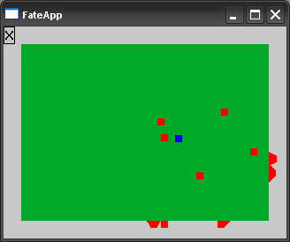
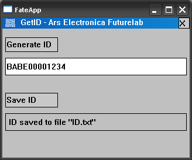
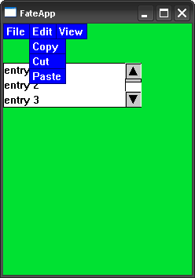
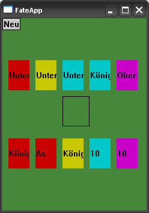
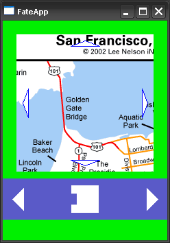
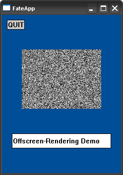
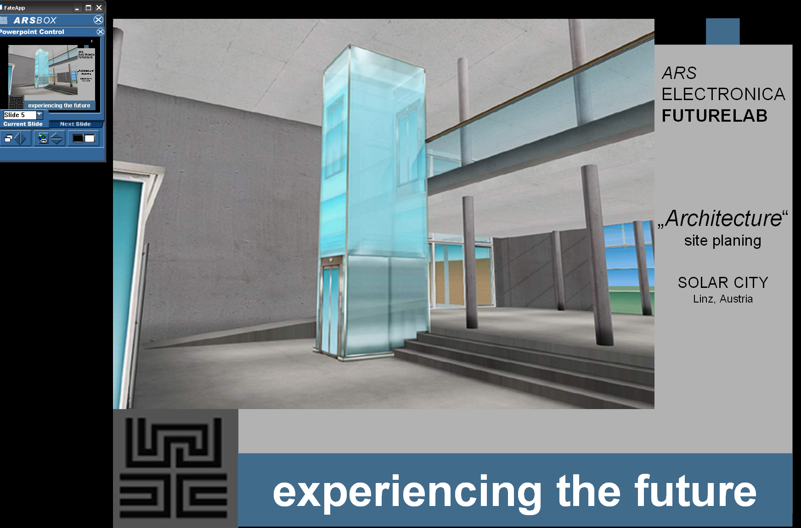
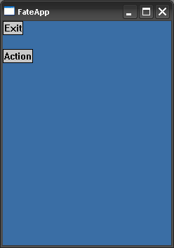
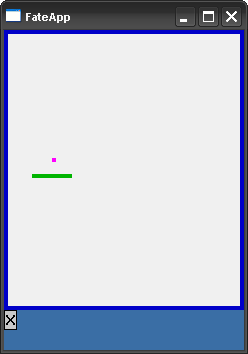

# FATE

## The Framework

<https://wolfgang-ziegler.com/repo/writing/thesis.pdf>

## Applications

### Cells

This was apparently just a test program I wrote when I was bored.
It implements a *very* simple steering algorithm. The blue dot chases the next red dot.

### GetID

This was a tool I wrote for the application **XEDIT** (see below). XEDIT was an actual
product I had developed for the [Ars Electronic Futurelab](https://ars.electronica.art/futurelab/) and
it could only be used on specific devices via a (very basic) dongle mechanism.

This tool would retrieve a device's unique ID that could then be used to generate the dongle.

(The Windows version does nothing).

### GUI_DEMO

This application was only developed for the screenshots in [thesis](https://wolfgang-ziegler.com/repo/writing/thesis.pdf).

### liquor

I remember that one day, when I was bored, I decided to implement the Austrian card game [Schnapsen](https://en.wikipedia.org/wiki/Schnapsen)
using my framework. Then I got distracted by something else and never finished it.

### Navi

This is another "showcase" application that I needed for my Thesis.
It demos the navigation control which is provided by the *FATE* framework.

### OffRenderDemo

Yet another demo application, for the "offscreen rendering control" provided by the *FATE* framework.

### PPC_PPTRC

This was actually a really cool application that I developed for the [Ars Electronic Futurelab](https://ars.electronica.art/futurelab/).
It allowed you to control a PowerPoint presentation from your PocketPC. You even got slide thumbnails sent to the device.

You need to start the [server application](etc/PPTRCv2) and it still works like a charm.

### SimpleTest

Another test app. This one I created specifically when I decided to implement the **PalmOS** port.
Spoiler alert: that port did not get very far.

### Snake

I was probably procrastinating and wrote this game when I should have worked on my thesis.
The snake can shoot missiles though.

### VRena_2.0 / VRena_2.5

This was the first and main showcase of my framework.
You could use the PocketPC to control a virtual environment, do picture slideshows, control Microsoft Powerpoint (what later became the standalone **PPC_PPTRC**).

### WAND

The actual *Wand* was a hardware device for interaction with VR environments.
This suite of demo applications showcased one of the framework's main features where a Pocket PC acts as such a Wand device.

### WAND_vePanel

### WAND_widgets

### XEDIT

This application was actually really great and I'm still proud of it today.
It would turn your PocketPC into a mobile recording studio. You could record and replay audio and even
perform cutting operations on the recorded `.wav` file.
It implemented a custom memory manager to make maximum use of the available memory.
We even sold a couple of licences back then.

